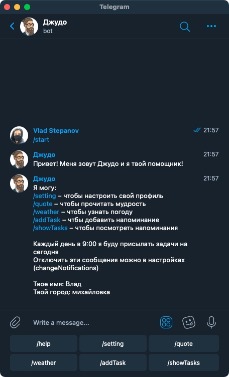
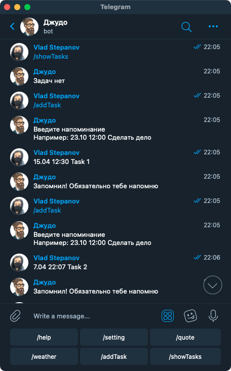
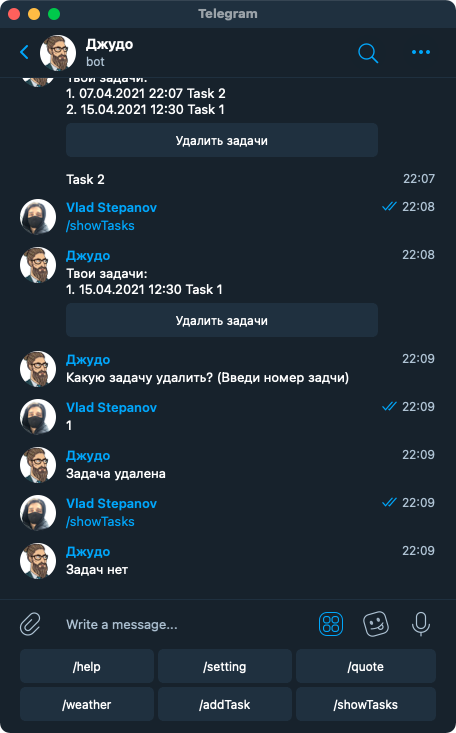

# Telegram Bot Judah

Бот, который подскажет погоду, напомнит о важных задачах и поделится мудрыми мыслями.
Бот написан на Java, в качестве бд используется PostgreSQL, в качестве сервера используется Heroku.

​

Каждый день бот присылает сообщение состоящие из текущей даты, задач, который пройдут в этот день, информацию о погоде и мудрую мысль.

​

В настройках мы можем изменить наши имя,  город и нужно ли присылать каждое утро сообщения.

​
​

В ответ на команды /waether и /quote бот присылает погоду и цитату

​

Добавление задач происходит после вызова команды /addTask. Для просмотра всех задач необходимо вызвать команду /showTasks. 
В списке задачи сортируются по времени. Так же имеется возможно удалить задачи

​
​
