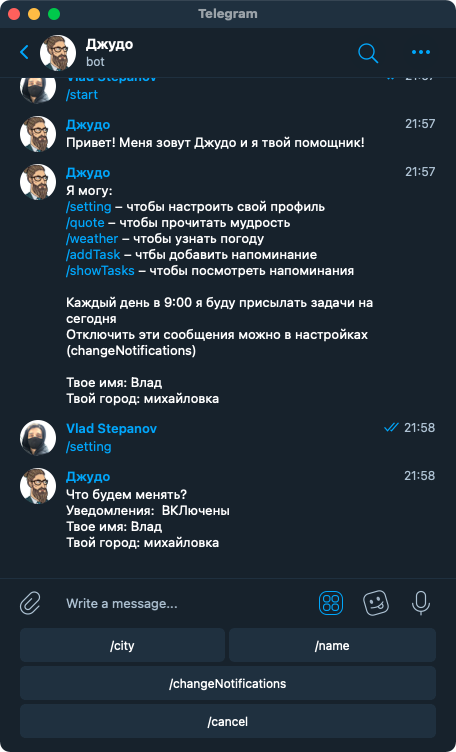

# Telegram Bot Judah

## Russian

Бот, который подскажет погоду, напомнит о важных задачах и поделится мудрыми мыслями.
Бот написан на Java, в качестве бд используется PostgreSQL, в качестве сервера используется Heroku.

​

Каждый день бот присылает сообщение состоящие из текущей даты, задач, который пройдут в этот день, информацию о погоде и мудрую мысль.

​

В настройках мы можем изменить наши имя,  город и нужно ли присылать каждое утро сообщения.

​
​

В ответ на команды /waether и /quote бот присылает погоду и цитату

​

Добавление задач происходит после вызова команды /addTask. Для просмотра всех задач необходимо вызвать команду /showTasks. 
В списке задачи сортируются по времени. Так же имеется возможно удалить задачи

​
​

## English

A bot that will tell you the weather, remind you of important tasks, and share quotes.
The bot is written in Java, PostgreSQL is used as a database, and Heroku is used as a server.

​

Every day, the bot sends a message consisting of the current date, the tasks that will take place on that day, weather information and a wise quots.

​

In the settings, we can change our name, city, and whether to send messages every morning.

​
​

In response to the /weather and /quote commands, the bot sends the weather and the quote

​

Adding tasks occurs after calling the /add Task command. To view all the tasks, call the /show Tasks command.
In the list, the tasks are sorted by time. It is also possible to delete tasks

​
​
